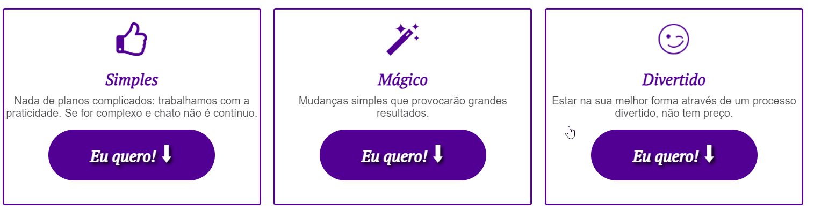
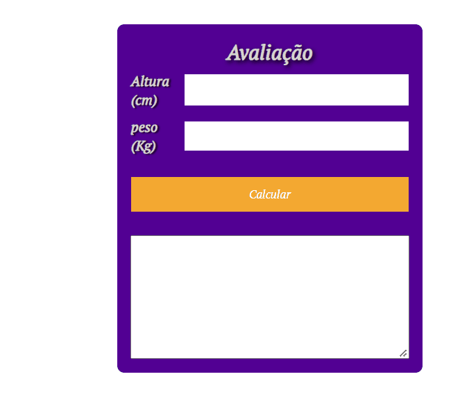
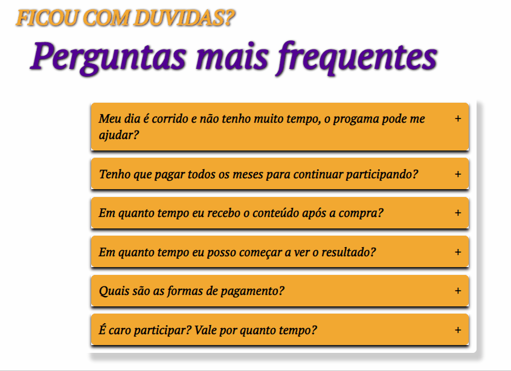
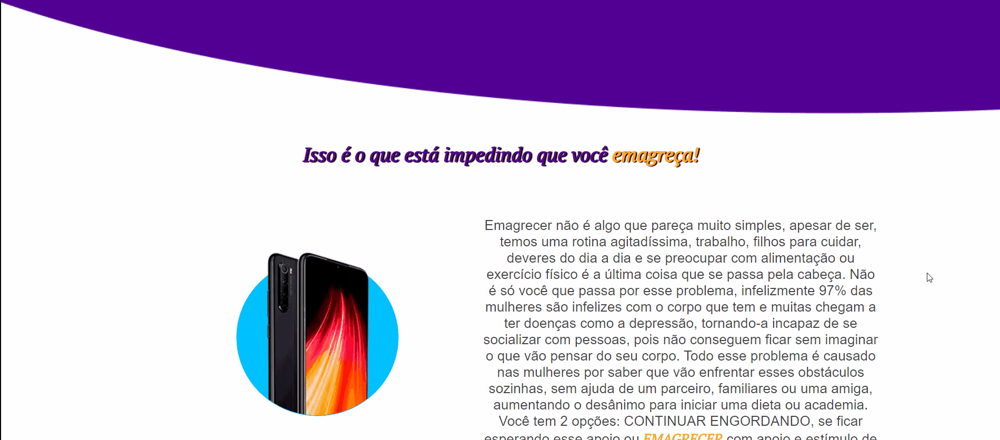

  

 Esse projeto foi a pedido de um cliente para poder fazer uma capture page, para poder captar dados de clientes <b>(ainda em contrução 🚧🚧)**não finalizado a pedido do cliente</b>

 <a href="#features">Features</a> •
 <a href="#tecnologias">Tecnologias</a> •
 <a href="#autor">Autor</a>

---

 

<h1 align="center">

  

</h1>

### Features

- [x] Efeito nos botões <h1 align="center"> </h1>-
- [x] Calculadora de IMC <h1 align="center"> </h1>
- [x] Slide automatizada <h1 align="center"> </h1>
- [x] Accordion <h1 align="accordion"> </h1>
- [x] Pop-Up ao retirar o mouse da pagina <h1 align="center"> </h1>

### Tecnologias

- [Html](https://www.w3schools.com/html/default.asp)
- [Css](https://www.w3schools.com/css/default.asp)
- [JavaScript](https://www.w3schools.com/js)

### Autor

Made by Thaynansp29 😎
 

<a href = "https://www.linkedin.com/in/thaynansp"> </img></a>
